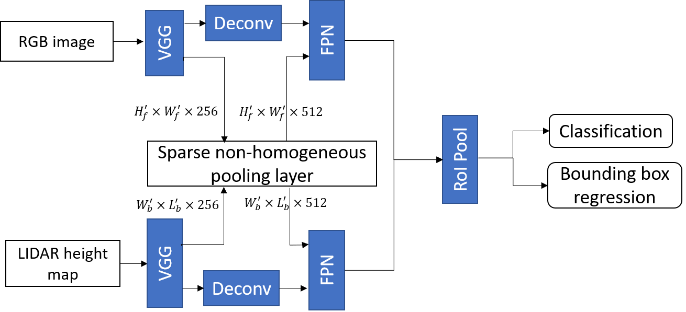

# Implementation of Sparse Non-homogeneous Pooling on Fusion-based Detection Networks
Sparse Pooling for LIDAR and Camera Fusion by Zining Wang

## Claim

Sparse Pooling is for fusing feature maps from different views and sources. Sparsity comes from the sparse correspondences between cells, such as point cloud. The layer is not only restricted to detection but also useful for segmentation. The main part is based on [**Fusing Bird View LIDAR Point Cloud and Front View Camera Image for Deep Object Detection**](https://arxiv.org/abs/1711.06703).

As the majority of the code comes from many existing repositories, including [MV3D_TF](https://github.com/leeyevi/MV3D_TF), [Avod-FPN](https://github.com/kujason/avod), [VoxelNet](https://github.com/jeasinema/VoxelNet-tensorflow) and [MSCNN](https://github.com/zhaoweicai/mscnn). If there is any thing inappropriate, please contact me through wangzining@berkeley.edu.

Results will be updated.

## Sparse Non-homogeneous Pooling for Feature Map Fusion of LIDAR and Camera
This is the introduction of the extension of the published work [**Fusing Bird View LIDAR Point Cloud and Front View Camera Image for Deep Object Detection**](https://arxiv.org/abs/1711.06703). The code is released on the github [Sparse_Pooling](https://github.com/ZiningWang/Sparse_Pooling). The problem considered here is the feature fusion of different sensors in CNNs shown as the figure below

The fusion happens at the middle-stage which is of the best performance according to the Kitti Benchmark on July 23, 2018. The middle-stage fusion propose to fuse features after the convolution and down-sampling operations of the raw data and before the region proposal network (RPN). The fusion keeps the training of the network end-to-end.

	

*middle-stage fusion*

The main contributions of the Sparse Non-homogeneous Pooling Layer (SHPL) are:
### Sparse Pooling Transforms and Preserves the Whole feature map
With the feature map preserved while the information of both sensors are fused, not only detection but also semantic segmentation and other tasks with fused features.  
One-stage detection framework can be utilized without RoI pooling which improves efficiency.  

### Easy to Incorperate with Existing Networks and Very Little Overhead
The following figure shows the integration of SHPL with Avod-FPN. It improves the average precision (AP) by feature fusion, adding a subtle overhead to the mean inference time on the validation dataset.
  

## Usage
The following two networks can be downloaded and run separately.

`avod` based on [Avod-FPN](https://github.com/kujason/avod) is the additional part. It aims to show that the SHPL can be easily added to other networks to allow efficient fusion of feature maps.

`MV3D_TF_release` is the network introduced in the paper. It fuses [VoxelNet](https://github.com/jeasinema/VoxelNet-tensorflow) and [MSCNN](https://github.com/zhaoweicai/mscnn) and uses focal loss for one-stage detection. 

## Code added/changed
This is for avod.
### Added:  
`core/feature_extractors/fusion_bgg_pyramid.py`:  For fusion right after vgg  
`utils/transform.py`:  Basic utility functions to preprocess input data  
`utils/sparse_pool_utils.py`: Main functions to construct the Sparse Non-homogeneous Pooling Layer

### Changed:
`bev_slices.py`: See code under `#WZN`. Add additional inputs of voxel indices for Sparse Pooling  
`rpn_model.py`:  See code under `#WZN`. Add placeholders and Sparse Pooling layer before rpn (controled by new parameters in config)  
`model.proto`:   Add 5 more parameters to control Sparse Pooling

## Reference
The 'Non-homogeneous' term came from [Spatial Transformer Networks](https://github.com/kevinzakka/spatial-transformer-network)

## LICENSE
### BSD License – Berkeley

Copyright (c) 2018 [Zining Wang](https://github.com/ZiningWang)

All rights reserved.

Redistribution and use in source and binary forms, with or without modification, are permitted provided that the following conditions are met:

* Redistributions of source code must retain the above copyright notice, this list of conditions and the following disclaimer.

* Redistributions in binary form must reproduce the above copyright notice, this list of conditions and the following disclaimer in the documentation and/or other materials provided with the distribution.

* Neither the name of the <organization> nor the names of its contributors may be used to endorse or promote products derived from this software without specific prior written permission.

THIS SOFTWARE IS PROVIDED BY THE COPYRIGHT HOLDERS AND CONTRIBUTORS "AS IS" AND ANY EXPRESS OR IMPLIED WARRANTIES, INCLUDING, BUT NOT LIMITED TO, THE IMPLIED WARRANTIES OF MERCHANTABILITY AND FITNESS FOR A PARTICULAR PURPOSE ARE DISCLAIMED. IN NO EVENT SHALL THE COPYRIGHT OWNER OR CONTRIBUTORS BE LIABLE FOR ANY DIRECT, INDIRECT, INCIDENTAL,SPECIAL, EXEMPLARY, OR CONSEQUENTIAL DAMAGES (INCLUDING, BUT NOT LIMITED TO, PROCUREMENT OF SUBSTITUTE GOODS OR SERVICES;LOSS OF USE, DATA, OR PROFITS; OR BUSINESS INTERRUPTION) HOWEVER CAUSED AND ON ANY THEORY OF LIABILITY, WHETHER IN CONTRACT, STRICT LIABILITY, OR TORT (INCLUDING NEGLIGENCE OR OTHERWISE) ARISING IN ANY WAY OUT OF THE USE OF THIS SOFTWARE,EVEN IF ADVISED OF THE POSSIBILITY OF SUCH DAMAGE.
