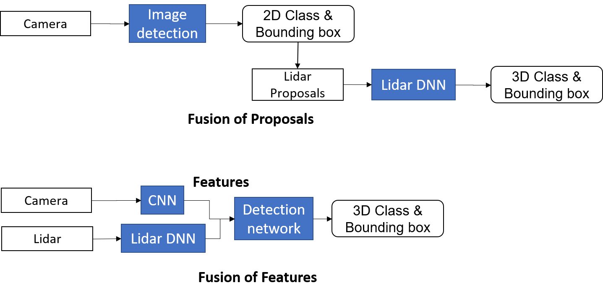
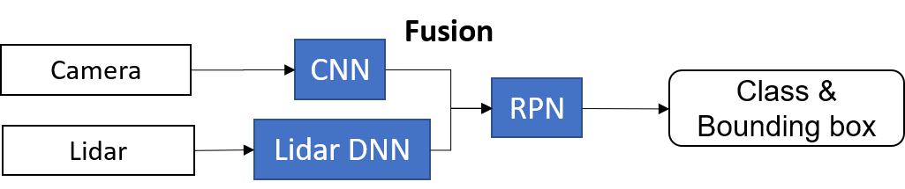
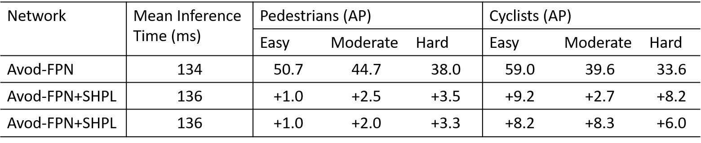

### Contents:

- [Introduction](#id1)
- [Sparse Non-homogeneous Pooling for Feature Map Fusion of LIDAR and Camera](#id2)
- [Videos](#id3)
- [Researchers](#id4)
- [Sponsors](#id5)
- [Acknowledgement](#id6)

## Lidar and Camera Fusion for 3D Object Detection based on Deep Learning for Autonomous Driving

<!-- Add your own introduction here -->

### Introduction

2D images from cameras provide rich texture descriptions of the surrounding, while depth is hard to obtain. On the other hand, 3D point cloud from Lidar can provide accurate depth and reflection intensity, but the solution is comparatively low. Therefore, 2D images and 3D point cloud are potentially supplementary to each other to accomplish accurate and robust perception, which is a prerequisite for autonomous driving.

Currently, there are several technical challenges in Lidar-camera fusion via convolutional neural network (CNN). Unlike RGB images for cameras, there is no standard input form for CNN from Lidars. Processing is required before fusing the 3D omnidirectional point cloud with the 2D front view images. The current region proposal networks (RPN), adapted from typical image processing structures, generate proposals separately and are not suitable for learning based on Lidar-camera fusion. Lidar-camera fusion enables accurate position and orientation estimation but the level of fusion in the network matters. Few works have been done on position estimation, and all existing works focus on vehicles.

In this project, our goal is to improve 3D object detection performance in driving environment by fusing 3D point cloud with 2D images via CNN. The RPN is applied to multiple layers of the whole network so that obstacles with different sizes in the front view are considered. We will be preprocessing Lidar and camera data from the KITTI benchmark and comparing the influence of Lidar data processing schemes by examining the contribution of Lidar information in detection. We will compare the region proposal accuracy in the form of 2D or 3D bounding boxes with other stereo-vision-based and fusion-based networks. Finally, we will collect data from real world traffic, pre-process and label the collected data according to the defined input and output of the CNN.

### Sparse Non-homogeneous Pooling for Feature Map Fusion of LIDAR and Camera
This is the introduction of the extension of the published work [**Fusing Bird View LIDAR Point Cloud and Front View Camera Image for Deep Object Detection**](https://arxiv.org/abs/1711.06703). The code is released on the github [Sparse_Pooling](https://github.com/ZiningWang/Sparse_Pooling). The problem considered here is the feature fusion of different sensors in CNNs shown as the figure below

The fusion happens at the middle-stage which is of the best performance according to the Kitti Benchmark on July 23, 2018. The middle-stage fusion propose to fuse features after the convolution and down-sampling operations of the raw data and before the region proposal network (RPN). The fusion keeps the training of the network end-to-end.

The main contributions of the Sparse Non-homogeneous Pooling Layer (SHPL) are:
#### Sparse Pooling Transforms and Preserves the Whole feature map
With the feature map preserved while the information of both sensors are fused, not only detection but also semantic segmentation and other tasks with fused features.  
One-stage detection framework can be utilized without RoI pooling which improves efficiency.  

#### Easy to Incorperate with Existing Networks and Very Little Overhead
The following figure shows the integration of SHPL with Avod-FPN. It improves the average precision (AP) by feature fusion, adding a subtle overhead to the mean inference time on the validation dataset.

### Videos

<iframe style = "position: absolute; width: 100%; height: 100%; left: 0; top: 0;"
  src="https://youtube.com/embed/MMhQFThzHA4?rel=0" frameborder="0" controls="controls" preload="auto" allowfullscreen></iframe>

Point-cloud and corresponding image data collected with crowded pedestrains at a crosswalkr

### Researchers

| Zining Wang | Graduate Student | [Email Link](mailto:wangzining@berkeley.edu)|

| Kiwoo Shin | Graduate Student | [Email Link](mailto:kiwoo.shin@berkeley.edu)|

| Wei Zhan | Graduate Student | [Email Link](mailto:wzhan@berkeley.edu) | 

### Sponsors

* [Berkeley Deep Drive](http://bdd.berkeley.edu)

### Acknowledgement

- We appreciate the help from Dr. Yi-Ta Chuang, Ehsan Javanmardi and Mahdi Javanmardi on data collection.